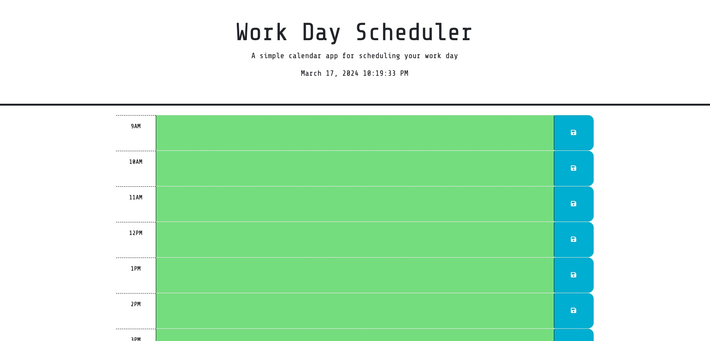

# DaySync

Plan your day with precision using the hourly breakdown scheduler "DaySync".

# Description

Daysync enables you to allocate time for tasks and save crucial information for each hour of the 9AM-5PM day, ensuring you complete each day as efficiently and completely as possible.

# Installation

N/A

# Technology Used

1.- HTML: Creating the structure of the website

2.- CSS: Styling the website by adjusting and giving color to our HTML elements

3.- JavaScript: Making our website to be interactive when users access it.

4.- Google Fonts: adding font-family and font-size from this website to the web application

# Usage

Daysync enables you to allocate time for tasks and save crucial information for each hour of the 9AM-5PM day, ensuring you complete each day as efficiently and completely as possible.

# Screenshot

# Credits: 
Max Chaidez
mdn web docs- code examples
W3schools online- code examples
Third Party Tutor Assistance

# Liscense
MIT License: https://github.com/Maxxxc1/DaySync/blob/main/LICENSE
